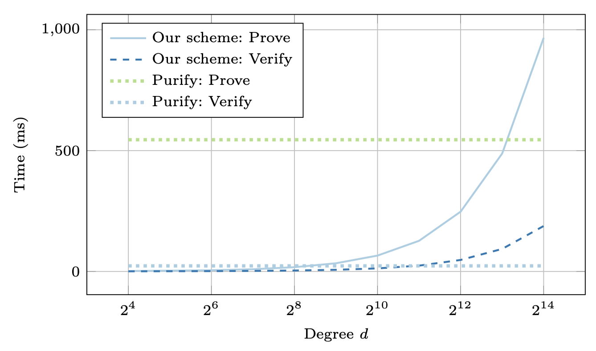

# Fully-Adaptive Two-Round Threshold Schnorr Prototype

This repository contains a prototype implementation accompanying the paper  
> **Fully-Adaptive Two-Round Threshold Schnorr Signatures from DDH**  
> Paul Gerhart, Davide Li Calsi, Luigi Russo, and Dominique Schröder  
> EUROCRYPT 2026

**⚠️ Prototype Disclaimer**  
This code is intended solely for research and benchmarking.
It is a proof of concept and has not been audited, is not hardened against side-channel attacks,  
and must not be used in production systems. Please use only in controlled, research, or testing environments.

## Overview

We implement the cryptographic core of our threshold signature scheme, which combines:

- **Polynomial evaluation**: signing randomness is derived by evaluating a secret polynomial $f$ at a given point $z$.
- **Proof of correct evaluation**: a polynomial commitment scheme ensures that the evaluation was done honestly.
- **Well-formedness of the first-round message**: proved by combining the polynomial commitment with a Chaum–Pedersen style proof.


## Cryptographic building blocks

- **Polynomial commitment scheme**  
  - Commitments: Pedersen commitments $C_f$ to the polynomial coefficients.  
  - Proofs: logarithmic-size inner-product arguments (from the [dalek-cryptography/bulletproofs](https://github.com/dalek-cryptography/bulletproofs) crate) for proving correct evaluation.

- **Chaum–Pedersen proof**  
  For showing correctness of the first-round message $R$ with respect to a signer's public key
  $$\mathsf{pk} = (g^x h^w v^u,\; C_f)$$
  and the evaluation point $z$.


## Code structure

- **`sig_setup.rs` / `sig_keygen.rs`**  
  Parameter setup and partial public key generation.

- **`rand_eval.rs`**  
  Core RelEval protocol: prover (`rel_eval_prove`) and verifier (`rel_eval_verify`).

- **`benches/bench_com.rs`**  
  Criterion benchmarks for proving and verifying correctness of the first-round message at different polynomial degrees $d$.

- **`benches/bench_poly.rs`**  
  Criterion benchmarks for polynomial evaluation, comparing stored coefficients against on-the-fly derivation via ChaCha8 and SHA-512.

- **`main.rs`**  
  A simple round-trip example: generate a proof, evaluate, and verify.


## Requirements

- Rust $\geq$ 1.75

All other dependencies (bulletproofs, curve25519-dalek, merlin, rayon, etc.) are declared in `Cargo.toml` and fetched automatically by Cargo.


## Usage

Build the project:

```bash
cargo build
```

Run the round-trip demo (from main.rs):
```bash
cargo run 
```

Run benchmarks:
```bash
cargo bench 
```

> **Note:** Running the full benchmark suite can take a significant amount of time (roughly 45 minutes on a typical laptop).


## Benchmark results

Results were obtained on an Apple M3 Pro with 36 GB RAM (`cargo bench --release`).
Raw output is in [`bench_results/`](bench_results/).

### Nonce derivation (prove + verify)

| Degree $d$ | Prove | Verify |
|------------|------:|-------:|
| 16         | 1.60 ms | 0.56 ms |
| 64         | 4.91 ms | 1.30 ms |
| 256        | 17.6 ms | 3.86 ms |
| 1 024      | 65.7 ms | 12.6 ms |
| 4 096      | 248 ms  | 47.6 ms |
| 16 384     | 967 ms  | 188 ms  |


### Comparison with MuSig-DN (Purify)

The Purify numbers come from running the benchmark binary in
[`secp256k1-zkp`](https://github.com/jonasnick/secp256k1-zkp) (the reference implementation of
MuSig-DN by Nick et al.) on the same machine:

| Protocol | Prove | Verify |
|----------|------:|-------:|
| Our scheme ($d = 8192$) | 488 ms | 93 ms |
| MuSig-DN / Purify       | 545 ms | 23 ms |

Both use Bulletproofs, so proof sizes are comparable (1124 bytes for Purify).
Our verification is slower because we use a pure-Rust Ristretto implementation, whereas
secp256k1-zkp uses hand-optimised multi-scalar multiplication on secp256k1.

### On-the-fly coefficient derivation

The secret key size for our scheme can be reduced to five field elements by deriving the respective polynomial coefficients on the fly instead of storing them. The overhead relative to table lookup is small:

| Degree $d$ | Stored | ChaCha8 | SHA-512 |
|------------|-------:|--------:|--------:|
| 16         | 1.4 µs | 3.4 µs  | 5.6 µs  |
| 1 024      | 39 µs  | 66 µs   | 83 µs   |
| 16 384     | 303 µs | 608 µs  | 900 µs  |
| 65 536     | 1.05 ms| 2.22 ms | 3.27 ms |

In all cases the evaluation cost is negligible compared to proof generation.

### Prove / verify time vs. degree

The figure below shows end-to-end proving and verification time for nonce derivation as a
function of the polynomial degree $d$ (log-scaled), measured via `bench_com.rs`.
The two horizontal baselines mark the fixed prove and verify cost of MuSig-DN (Purify),
which does not depend on a degree parameter.
Our scheme crosses the Purify prove baseline at around $d = 8192$ and stays well below it
for smaller degrees; verification remains faster than Purify across the entire range.



